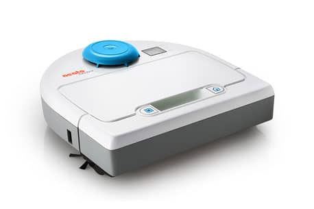
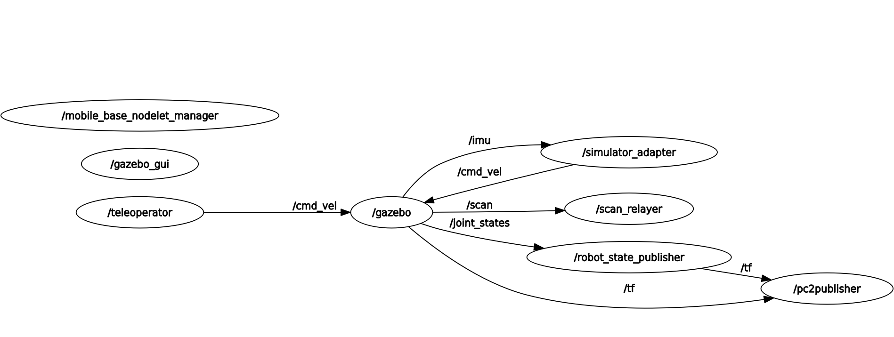
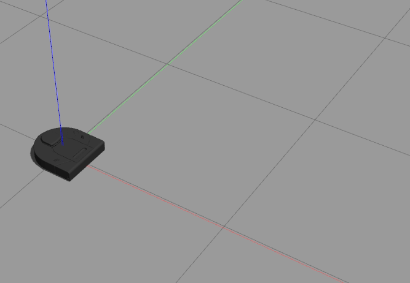
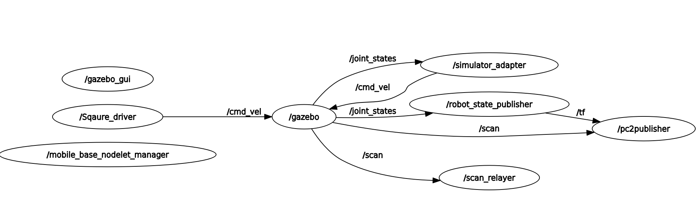
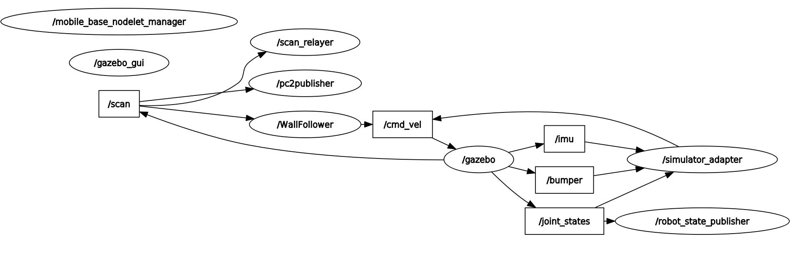
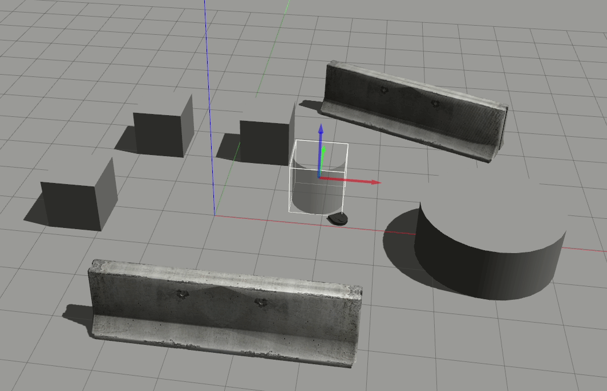
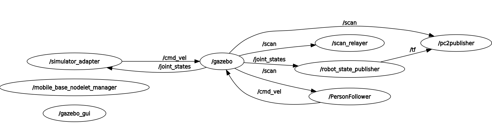
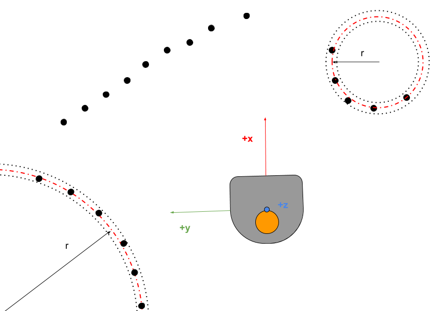
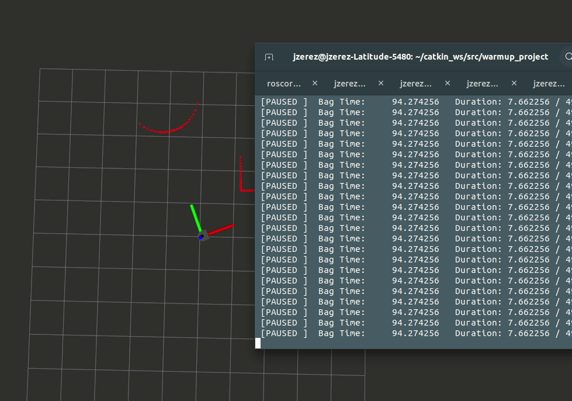

# Warm-up Project
*ENGR3590: A Computational Introduction to Robotics, Olin College of Engineering, FA2020*

*Jonathan Zerez*

This project contains a number of basic introductory exercises to build familiarity with the ROS ecosystem and some of the various tools that can be used to create and run simulations. For this class, we're using [Gazebo](http://gazebosim.org/) for the simulation engine, and [Rviz](http://wiki.ros.org/rviz) for visualization.

This project's robotic platform is the NEATO vacuum robot. The NEATO is equipped with a number of basic sensors including wheel encoders, a small array of bump sensors, and a 2D LIDAR unit. Below is an image of a NEATO. The blue circle atop the unit is the LIDAR sensor.

The exercises for this project are as follows:
1. [Tele-operation]
2. [Driving in a Square]
3. [Wall Follower]
4. [Person Follower]
5. [Obstacle Avoidance]
6. [Finite State Controller]

## Tele-operation
The goal of the exercise was to be able to control the NEATO using inputs from the keyboard. This functionality is really basic and gives good foundation to build upon for other behaviors in the future.

In my implementation, the W-A-S-D keys toggle specific movements. For instance, if the W key is pressed, the NEATO will continue to go forward until another key is pressed. If the next key stroke is A or D, it will turn in place. If the next key stroke is S, it will go backwards. If it is any key that is not W, A, S, or D, the NEATO stops and waits for a new command.

### Implementation
From a high level, this project is rather straightforward. The program initializes a node called `teleoperator` that publishes `Twist` messages to the `cmd_vel` topic. While the program is running, it is constantly monitoring the keyboard for inputs, and simply publishes the correct velocity commands based on what it observes. Below is a graph of nodes and the topics that connect them.

From a code structure point of view, I implemented the tele-operator as its own class. This was useful because I could then use the class's functionality (ex: reading key presses) for other parts of this project. In order to do this, I had to make sure that the creation of a new ROS node was a toggle-able attribute. This allows me to create a Teleoperator object that is an attribute of another class that initializes its own ROS Node.

### Challenges and Areas of Improvement
It would be interesting if my implementation of the tele-operator could handle simultaneous inputs. For instance, if the W and A keys are pressed simultaneously, it would be cool if the NEATO drove in an arc (ie: going forwards while turning).

I also think that this implementation would be improved if the NEATO only moved while a key is held down. Having to press a different key to stop the NEATO is kind of a pain.

## Driving in a Square
The goal of the exercise was to make the NEATO drive in a 1 meter square. Below is an animation of the behavior.

### Implementation
My implementation of this was relatively simple. The program initializes a node called `Square_driver` that publishes `Twist` messages to the `cmd_vel` topic. The program has an internal clock that waits for pre-set intervals and alternatively tells the NEATO to move forward and then turn. The time intervals were manually determined in order to ensure the NEATO traveled roughly 1 meter while going forward, and turned roughly 90 degrees while rotating.

From a code structure point of view, I didn't bother creating a unique class for this program. Because this was a relatively straightforward task, the program didn't really have any functionality that was worth saving and reusing elsewhere.

### Challenges and Areas of Improvement
Hard-coding the time values allowed me to get reasonably close to a perfect 1 meter square, but small errors tend to compound and the NEATO doesn't end up exactly where it starts.

It would have been slightly more interesting (and perhaps more accurate) if I had subscribed to the `odom` topic in order to get estimations of the NEATO's pose in the global frame. This would have been much more elegant than hard-coding periods of time to wait between moves. In real life, this would allow for better consistency, as the NEATO could travel different distances over the same period of time depending on battery life.

Using the odometry information from the encoders however, would not guarantee precision. If the wheels slip relative to the floor, then the estimation of the NEATO's pose in the global frame would be a bit off.

## Wall Follower
The point of this exercise was to use the LIDAR sensor to align the NEATO to drive parallel to a wall while moving forward continuously.Below is an animation of the wall follower in action.

### Implementation
From a high level, the program initializes a node called `WallFollower` that publishes `Twist` messages the `cmd_vel` topic and subscribes to `LaserScan` messages from the `scan` topic. Below is a graph of the nodes and the topics that connect them.

In order to get the wall following behavior, I split the incoming LIDAR scans into zones based on angular position. One of the zones, `r_1's`, is from 270 degrees to 315 degrees (this is everything 45 degrees in front of the rightmost LIDAR scan). The other zone, `r_2's` is from 225 degrees to 270 degrees (this is everything 45 degrees behind of the rightmost LIDAR scan). Then, I compare the mean distance from the first zone to the second zone. I use a proportional controller that applies a constant `k` to the difference of the means in order to generate a steer command.

Comparing mean distances serves to filter out minor noise from the LIDAR scan or any inconsistencies in the wall being followed.

I also check the smallest 15 LIDAR data points and only apply the turning logic when the mean of those points surpasses a certain threshold. This helps the NEATO to remain relatively close to the wall while following it.

From a code structure point of view, I created a new class called `WallFollower` for the node and any behaviors.

### Challenges and Areas of Improvement
I had to overcome a number of challenges in this exercise. Most of these challenges stem from the fact that I was originally not running Gazebo on the GPU and was getting erroneous LIDAR scans. While it is certainly not unrealistic to receive erroneous LIDAR scans, I needed to put extra care into filtering out any bad (usually `inf` or `nan`) data points.

There are a number of ways in which I can improve the implementation of this exercise:
* I could create a PID or PI controller rather than just a proportional one in order to more quickly converge to parallel driving with the wall
* I could look at the average angular location of the smallest 15 LIDAR scans and reorient the `r_1's` and `r_2's` zones so that the NEATO could follow walls to the right and to the left
* I could work to analyze data points much further in front of the NEATO (ie: from 270 degrees to 360 degrees) in order to to be able to react to sharp inner or outer corners
* I could implement a `Teleoperator` object to the class so that a user could drive the NEATO around, but the NEATO would automatically avoid walls.

## Person Follower
The person follower exercise's goal was to implement attractive behavior. The NEATO needed to identify a "person" and follow it as it moved around and maintain a specified distance. I chose to use a cylinder of with a diameter of 1 meter to represent a human. Below is an animation of the NEATO exhibiting this behavior.

### Implementation
From a high level, the program initializes a node called `PersonFollower` that publishes `Twist` messages the `cmd_vel` topic and subscribes to `LaserScan` messages from the `scan` topic. Below is a graph of the nodes and the topics that connect them.

In this exercise, I wrote a version of RANSAC to work on circular objects. From the set of LIDAR data points, I select a 3 data points that are relatively close to each other (5 degrees apart from each other). Because 3 points determine a circle, I can fit a circle to these three points. Using the center and radius of this circle, I count the number of LIDAR points that within 5 centimeters of the calculated radius. I perform this 3 point sampling a number of times and find the candidate circle that has the greatest number of member data points and is reasonably close to the target radius size of half of a meter. Below is a diagram of how circular RANSAC works.

Once a candidate circle is chosen, its center coordinate is designated as the goal for the NEATO. By using the arc-tangent function, I calculate the heading angle of the circle's center with respect to the NEATO's forward direction. This angle is fed into a proportional controller to try to align the NEATO's heading. The distance to the circle's center is fed into a different proportional controller to move the NEATO close to the circle's center. Finally, I used a threshold to stop the NEATO a set difference away from the circle's center (because it is impossible for the NEATO to exactly reach the circle's center).

Like many of the other exercises, I implemented this as its own class.

### Challenges and Areas of Improvement
There weren't any unforeseen or unreasonable challenges that I had to face while doing this exercise. However, there are a number of possible ways that I could improve this:

* My implementation of Circular RANSAC is not extremely robust and could be improved.
  * The problem with counting the number of points that belong to a given circle fitting is that closer objects inherently have an advantage given that more LIDAR points hit them. The NEATO mis-identifies the target if it is too close to an object, especially if that object is also circular (but has the wrong radius)
  * If there is a cluster of points from separate objects that happen to be somewhat equidistant from a central point, it can mis-identify the target. This could potentially be solved by using a clustering algorithm to only consider points that belong to the same cluster. It could also be useful to also try to measure the relative curvature between consecutive points
* My implementation of Circular RANSAC is also not very computationally efficient. Currently, it takes 360 samples, and I think that that could be reduced. Additionally, it could be streamlined further if I start searching for circles close to where the target was reported in the previous scan.
* The two proportional controllers (one for heading/angle and one for forward velocity) work, but are a bit "under-damped", especially the angular controller. I could improve this behavior by further tuning the constants and potentially adding an integral or derivative term to the controller.
* I could also try to make the scenario a bit more realistic by looking for a pair of circles that are close to each other. This would be a bit more like look at a human's legs.

## Obstacle Avoidance
The purpose of this exercise was to make the NEATO move towards a goal while automatically avoiding any obstacles in the way. I decided to choose an arbitrary point in the global frame to be the goal for the NEATO in order to get some practice with using the transformation libraries from ROS. Below is an animation of the NEATO completing this task. This one is in Rviz so that you can see the goal for the NEATO.

### Implementation
The high-level structure of this of this program is a little bit different than the  others. A node called `obstacle_avoider` is initialized. This node subscribes to the `scan` topic publishes to the `cmd_vel` topic. Interestingly, This project inherits from the `PersonFollower` class but doesn't actually use any of the built in functionality that it provides in any significant way.

On a technical level, I created a very simple algorithm to avoid obstacles while navigating to a target. The program takes each vector that represents a lidar point, scales them based on their distance to the NEATO, and sums them to create a "repulsion" vector. Additionally I add an "attraction" vector which points towards the goal.

Because the goal is a hardcoded point in the global frame, I need to constantly transform from the global frame to the NEATO reference frame to assign velocity commands. To do this, I use a `TransformListener` object from the `tf2_ros` library. Using this I can query for the coordinate transform between the NEATO frame, `base_footprint`, and the global frame, `odom`. I can then apply the transformation to the target to get it in terms of the NEATO's reference frame.

Once the attraction and repulsion vectors are added together, I use a simple proportional controller to adjust the NEATO's heading. The linear velocity is togged using a simple distance threshold (bang-bang controller).

### Challenges and Areas of Improvement
The main challenges and areas of improvement for this exercise come in the form of tuning the algorithm. There are a number of hard-coded constants that determine things like:
* The scaling of repulsion for LIDAR Points
* The magnitude of attraction for the target
* The rate of turning

Apart from a lot of trial and error, I don't really know how to better tune these constants, but I know that if they were optimized, then the behavior of the NEATO would be a lot more robust. Additionally, such optimizations would allow the NEATO to more often take a more direct path to the target.  

## Finite State Controller
